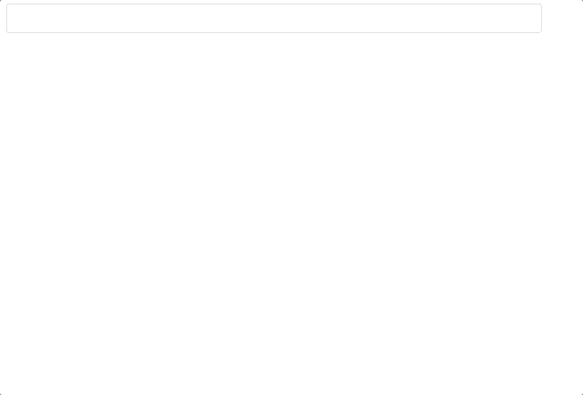

## inp-v-search


## Live



## Installation
```
npm i vue-input-search
```

### Default import
Install all the components:
```javascript

import 'vue-input-search/dist/vue-search.css'
import VueSearch from 'vue-input-search/dist/vue-search.common'

const app = new Vue({
    el: '#app',
    components:{
        'vue-search':VueSearch
    }
}
```
```html
<vue-search 
    :img-photo="'path-img'" 
    @newitem="newitem()" 
    @itemselected="itemselected($event)" 
    :source-field="'name'" 
    :show-new-botton="true"
    :search-by-field="false"
    :api-source="'https://url-data-source'"
    ></vue-search>

```


# Settings


Option | Type | Default | Description
------ | ---- | ------- | -----------
placeholder | String | '' | Placeholder text
showNewBotton | Boolean | true | Show or not the new bottom
searchByField | Boolean | true | Enable find by field name of datasource
txtNotFound | String | 'No one found with that name' | Text when there is no data
txtBtnNew | String | 'Create A New Element' | Text of new button 
inputClass | Object | {} | Custom class css {'form-control':true} 
model | String | '' | Model
imgPhoto | String | '' | Image of circle list element 
ApiSource | String | '' | Acces point API
SourceField | String | 'name' | If searchByField is true use this

